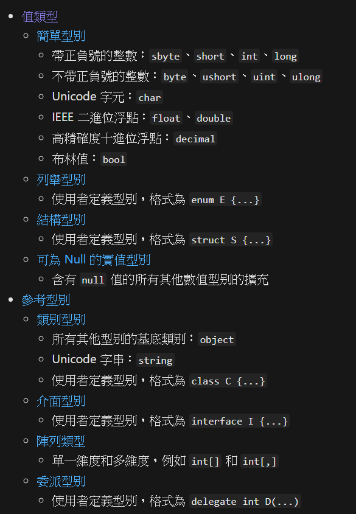
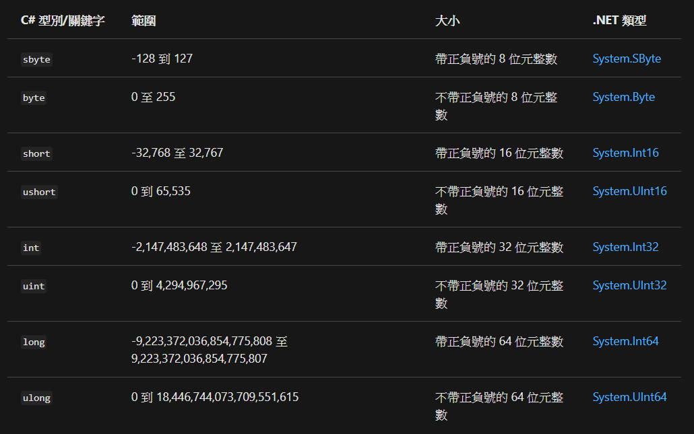
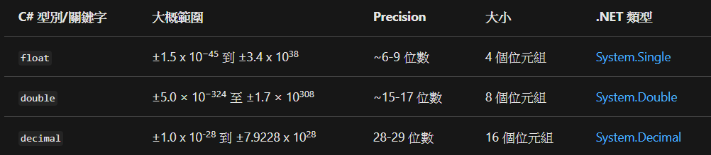

# C# 變數

- 實值型別 (Value types)
  - 簡單型別
    - 整數
      - 整數型別
      - 整數常值
    - 浮點數
      - 浮點數型別
      - 浮點數常值
---
## 整數型別

```C#
int a = 123;
System.Int32 b = 123;
```
---
## 整數常數
整數常值可以是
- decimal：不含任何前置詞
- 十六進位：使用 0x 或 0X 前置詞
- binary：具有 0b 或 0B 前置詞（可在C# 7.0 和更新版本中取得）
```C#
var decimalLiteral = 42;
var hexLiteral = 0x2A;
var binaryLiteral = 0b_0010_1010;
```
整數常值的類型是由其後綴決定，如下所示：
- 如果常值沒有後置詞，其類型會是下列類型中可表示其值的第一個型別： int、uint、long、ulong。
- 如果常值是以 U 或 u為後置字元，則其類型會是下列類型中可表示其值的第一個型別： uint、ulong。
- 如果常值是以 L 或 l為後置字元，則其類型會是下列類型中可表示其值的第一個型別： long、ulong。
---
## 整數轉換
---
## 浮點數型別

```C#
double a = 12.3;
System.Double b = 12.3;
```
您可以在運算式中混合整數類資料類型和 float 和 double 類型。 在此情況下，整數類資料類型會隱含地轉換成其中一個浮點類型，並在必要時，將 float 類型隱含地轉換成 double。 運算式評估如下：
- 如果運算式中有 double 類型，則運算式會評估為 double，或bool在關聯式和相等比較中。
- 如果運算式中沒有 double 類型，則運算式會評估為 float，或 bool 在關聯式和相等比較中。
---
## 浮點數常值
實際常值的類型取決於其後置詞，如下所示：
- 不含尾碼或具有 d 或 D 尾碼的常值屬於類型 double
- 具有 f 或 F 尾碼的常值屬於類型 float
- 具有 m 或 M 尾碼的常值屬於類型 decimal
```C#
double d = 3D;
d = 4d;
d = 3.934_001;

float f = 3_000.5F;
f = 5.4f;

decimal myMoney = 3_000.5m;
myMoney = 400.75M;
```
---
## 浮點數轉換
---
# 非數值類型
- Unicode 字元：char
- 布林值：bool
- 列舉型別(enum E {...})
- 結構型別(struct S {...})
以上是實值型別 (Value types)

接下來介紹參考型別(Reference types)
- 類別型別
  - 所有其他型別的基底類別︰object
  - Unicode 字串：string
  - 使用者定義型別，格式為 class C {...}
- 介面型別(interface I {...})
- 陣列類型(單一維度和多維度，例如 int[] 和 int[,])
- 委派型別(格式為 delegate int D(...))
---
# 額外介紹
- Nullable -> 給可為null的類型使用
- Nullable<T> -> 給不可為null的類型擴充

ex:
```C#
string s = null;
Nullable<int> i = null;
//也可寫成
int? i = null;