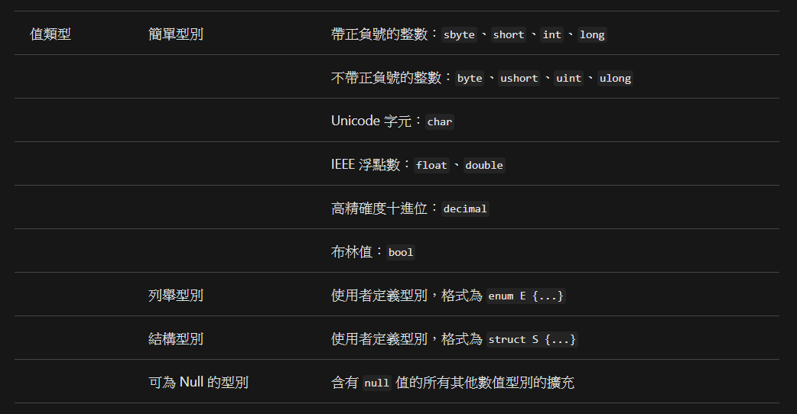
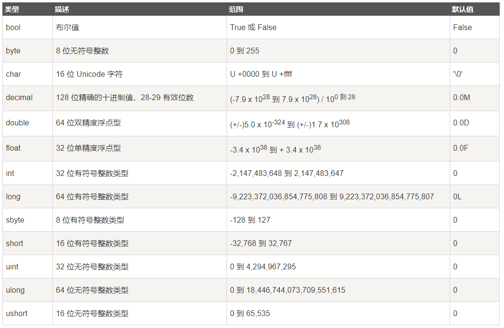
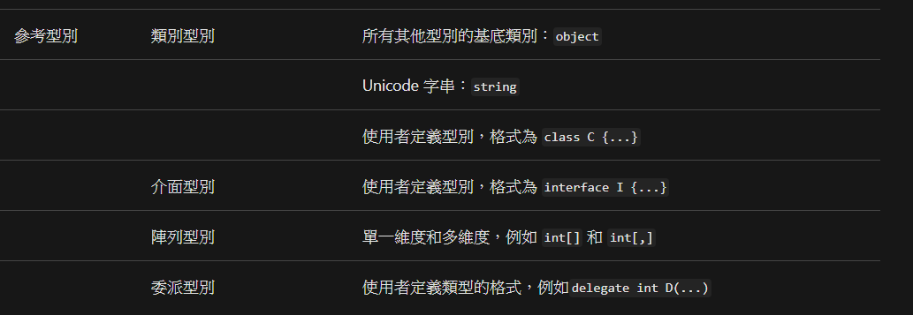

# C#資料類型
C#的資料類別分為幾大類:
- 實值型別 (Value types)
- 參考型別 (Reference types)
- 指針（Pointer types）-unmanage
---
## 實值型別 (Value types)

對應的資料內容:

## 參考型別 (Reference types)

## 指針（Pointer types）-unmanage

在C#中不建議使用

---
# C#類型轉換
- 隱含轉換
- 明確轉換(強轉型)
https://www.runoob.com/csharp/csharp-type-conversion.html
https://docs.microsoft.com/zh-tw/dotnet/csharp/programming-guide/types/casting-and-type-conversions
https://docs.microsoft.com/zh-tw/dotnet/csharp/programming-guide/types/boxing-and-unboxing
