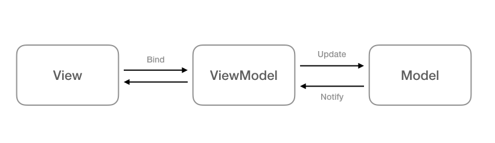

# MVVM架構(Model-View-ViewModel)
MVVM是Model-View-ViewModel的簡稱，三者扮演的角色為：

- Model：管理資料來源如API和本地資料庫
- View：顯示UI和接收使用者動作
- ViewModel：從Model取得View所需的資料

## MVVM 架構有幾個主要的優點：
- 資料驅動：  
事件都透過資料的變化來觸發，資料成為最關鍵的因素。
下層元件不需要知道上層元件：
在 MVC / MVP 中，都需要有 View 的引用來更新 UI。但在 MVVM 中，由View 主動觀察資料，在資料變化後收到通知，而自動更新。 ViewModel 不需要知道 View 是誰。
- 職責分離：  
ViewModel 中可以減少大量通知 View 的程式碼，專心的管理流程。
Activity 和 Fragment 不用儲存資料狀態，可以專心管理介面的操作和顯示，並妥善控制生命週期。

## 實例:  
https://github.com/MarkWithall/worlds-simplest-csharp-wpf-mvvm-example/tree/C%236.0
