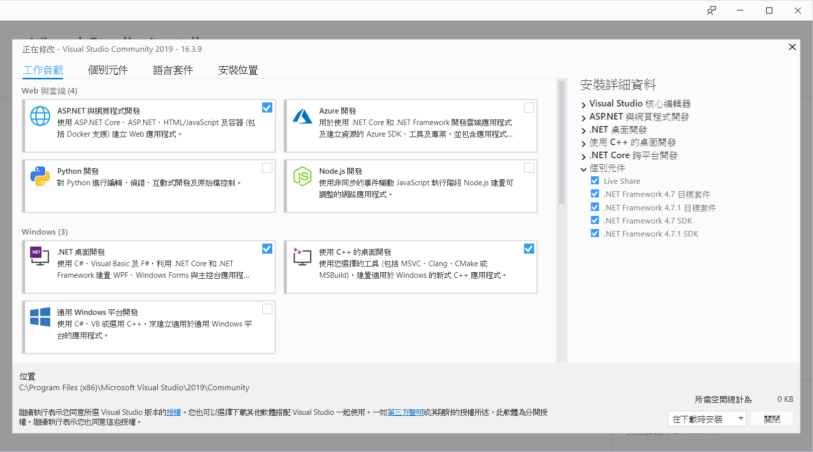
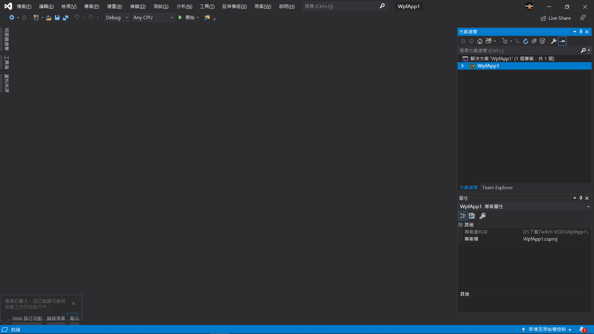
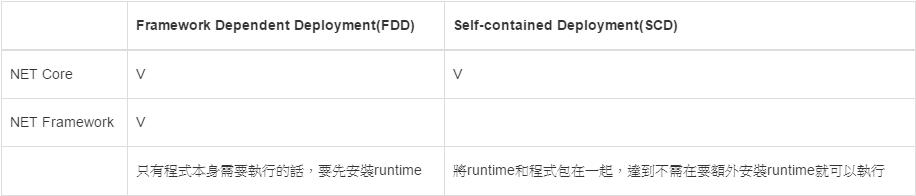

# 整合開發環境(Integrated Development Environment，簡稱IDE)

- 偵錯
  - 中斷點
  - 逐步執行

- [快捷鍵](https://dotblogs.com.tw/asdtey/2009/10/06/10924)

- 套件推薦
  - [XAML Styler](https://marketplace.visualstudio.com/items?itemName=TeamXavalon.XAMLStyler) 

  - [CodeMaid](https://marketplace.visualstudio.com/items?itemName=SteveCadwallader.CodeMaid)

  - [SonarLint](https://marketplace.visualstudio.com/items?itemName=SonarSource.SonarLintforVisualStudio2019)

- NuGet

---
# 題外話

.Net Framework 與 .Net Core的差異

- 跨平台
- 發布方式不同

主要是交集的概念
