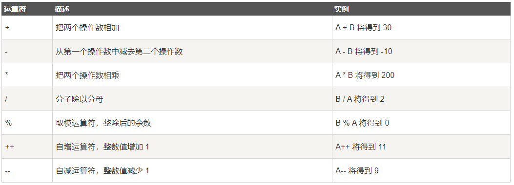
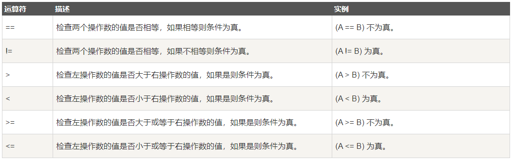
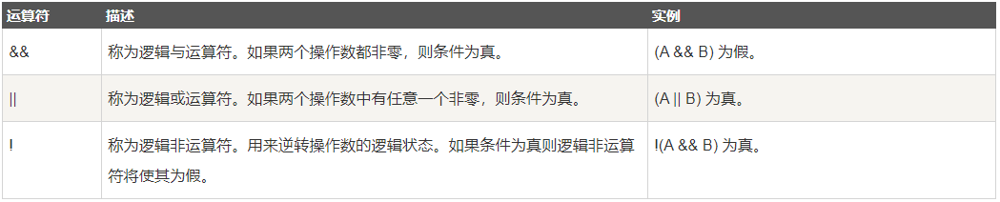
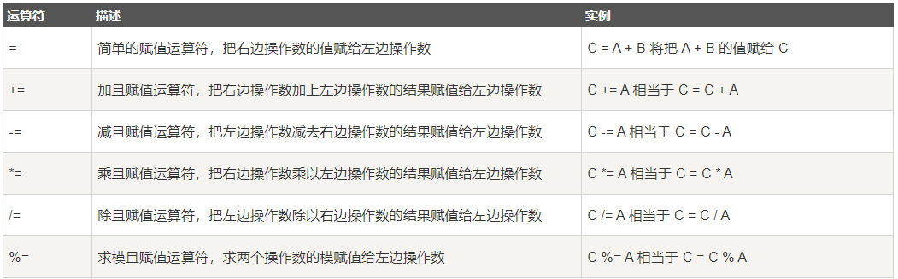
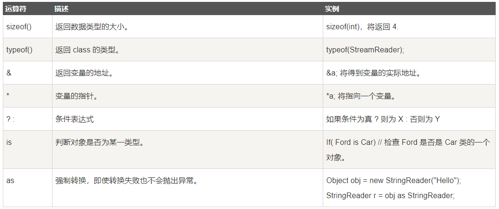
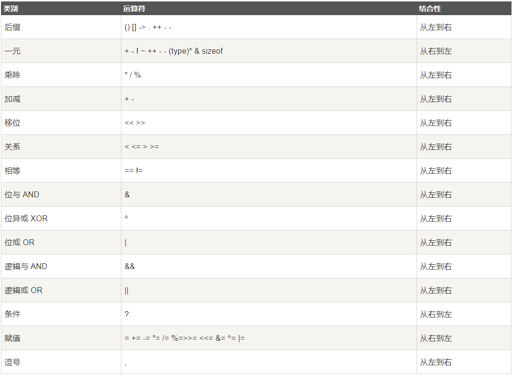

# 運算子  

運算子是一種告訴編譯器執行特定的數學或邏輯操作的子號。C# 有豐富的內置運算子，分類如下：

- 算術運算子
- 關係運算子
- 邏輯運算子
- 位運算子
- 賦值運算子
- 其他運算子
---
## 算術運算子
下表顯示了 C# 支援的所有算術運算子。假設變數 A 的值為 10，變數 B 的值為 20，則：




實例
請看下面的實例，了解 C# 中所有可用的算術運算子：
```C#
using System;

namespace OperatorsAppl
{
    class Program
    {
        static void Main(string[] args)
        {
            int a = 21;
            int b = 10;
            int c;

            c = a + b;
            Console.WriteLine("Line 1 - c 的值是 {0}", c);
            c = a - b;
            Console.WriteLine("Line 2 - c 的值是 {0}", c);
            c = a * b;
            Console.WriteLine("Line 3 - c 的值是 {0}", c);
            c = a / b;
            Console.WriteLine("Line 4 - c 的值是 {0}", c);
            c = a % b;
            Console.WriteLine("Line 5 - c 的值是 {0}", c);

            // ++a 先進行自增運算再賦值
            c = ++a; //c = a + 1;
            Console.WriteLine("Line 6 - c 的值是 {0}", c);

            // 此時 a 的值為 22
            // --a 先進行自減運算再賦值
            c = --a; //c = a - 1;
            Console.WriteLine("Line 7 - c 的值是 {0}", c);
            Console.ReadLine();
        }
    }
}
```
當上面的代碼被編譯和執行時，它會産生下列結果：

> Line 1 - c 的值是 31  
> Line 2 - c 的值是 11
> Line 3 - c 的值是 210  
> Line 4 - c 的值是 2  
> Line 5 - c 的值是 1  
> Line 6 - c 的值是 22  
> Line 7 - c 的值是 21  
> c = a++: 先將 a 賦值給 c，再對 a 進行自增運算。  
> c = ++a: 先將 a 進行自增運算，再將 a 賦值給 c 。  
> c = a--: 先將 a 賦值給 c，再對 a 進行自減運算。  
> c = --a: 先將 a 進行自減運算，再將 a 賦值給 c 。  
---
## 關係運算子
下表顯示了 C# 支援的所有關係運算子。假設變數 A 的值為 10，變數 B 的值為 20，則：

實例:
```C#
using System;

class Program
{
  static void Main(string[] args)
  {
      int a = 21;
      int b = 10;
     
      if (a == b)
      {
          Console.WriteLine("Line 1 - a 等於 b");
      }
      else
      {
          Console.WriteLine("Line 1 - a 不等於 b");
      }
      if (a < b)
      {
          Console.WriteLine("Line 2 - a 小於 b");
      }
      else
      {
          Console.WriteLine("Line 2 - a 不小於 b");
      }
      if (a > b)
      {
          Console.WriteLine("Line 3 - a 大於 b");
      }
      else
      {
          Console.WriteLine("Line 3 - a 不大於 b");
      }
      /* 改變 a 和 b 的值 */
      a = 5;
      b = 20;
      if (a <= b)
      {
         Console.WriteLine("Line 4 - a 小於或等於 b");
      }
      if (b >= a)
      {
         Console.WriteLine("Line 5 - b 大於或等於 a");
      }
  }
}
```
當上面的代碼被編譯和執行時，它會産生下列結果：

> Line 1 - a 不等於 b  
> Line 2 - a 不小於 b  
> Line 3 - a 大於 b  
> Line 4 - a 小於或等於 b  
> Line 5 - b 大於或等於 a  
---
## 邏輯運算子
下表顯示了 C# 支援的所有邏輯運算子。假設變數 A 為佈爾值 true，變數 B 為佈爾值 false，則：


實例:
```C#
using System;

namespace OperatorsAppl
{
    class Program
    {
        static void Main(string[] args)
        {
            bool a = true;
            bool b = true;
           
            if (a && b)
            {
               Console.WriteLine("Line 1 - 條件為真");
            }
            if (a || b)
            {
                Console.WriteLine("Line 2 - 條件為真");
            }
            /* 改變 a 和 b 的值 */
            a = false;
            b = true;
            if (a && b)
            {
                Console.WriteLine("Line 3 - 條件為真");
            }
            else
            {
                Console.WriteLine("Line 3 - 條件不為真");
            }
            if (!(a && b))
            {
                Console.WriteLine("Line 4 - 條件為真");
            }
            Console.ReadLine();
        }
    }
}
```
當上面的代碼被編譯和執行時，它會産生下列結果：
> Line 1 - 條件為真  
> Line 2 - 條件為真  
> Line 3 - 條件不為真  
> Line 4 - 條件為真  

賦值運算子(assign)
下表列出了 C# 支援的賦值運算子：



實例:
```C#
using System;

namespace OperatorsAppl
{
    class Program
    {
        static void Main(string[] args)
        {
            int a = 21;
            int c;

            c = a;
            Console.WriteLine("Line 1 - =  c 的值 = {0}", c);

            c += a;
            Console.WriteLine("Line 2 - += c 的值 = {0}", c);

            c -= a;
            Console.WriteLine("Line 3 - -=  c 的值 = {0}", c);

            c *= a;
            Console.WriteLine("Line 4 - *=  c 的值 = {0}", c);

            c /= a;
            Console.WriteLine("Line 5 - /=  c 的值 = {0}", c);

            c = 200;
            c %= a;
            Console.WriteLine("Line 6 - %=  c 的值 = {0}", c);

            Console.ReadLine();
        }
    }
}
```
當上面的代碼被編譯和執行時，它會産生下列結果：

> Line 1 - =     c 的值 = 21  
> Line 2 - +=    c 的值 = 42  
> Line 3 - -=    c 的值 = 21  
> Line 4 - *=    c 的值 = 441  
> Line 5 - /=    c 的值 = 21  
> Line 6 - %=    c 的值 = 11  
---
## 其他運算子
下表列出了 C# 支援的其他一些重要的運算子，包括 sizeof、typeof 和 ?:



實例
```C#
using System;

namespace OperatorsAppl
{
   class Program
   {
      static void Main(string[] args)
      {
         
         /* sizeof 運算子的實例 */
         Console.WriteLine("int 的大小是 {0}", sizeof(int));
         Console.WriteLine("short 的大小是 {0}", sizeof(short));
         Console.WriteLine("double 的大小是 {0}", sizeof(double));
         
         /* 三元運算子的實例 */
         int a, b;
         a = 10;
         b = (a == 1) ? 20 : 30;
         Console.WriteLine("b 的值是 {0}", b);

         b = (a == 10) ? 20 : 30;
         Console.WriteLine("b 的值是 {0}", b);
         Console.ReadLine();
      }
   }
}
```
當上面的代碼被編譯和執行時，它會産生下列結果：
> int 的大小是 4  
> short 的大小是 2  
> double 的大小是 8  
> b 的值是 30  
> b 的值是 20 
--- 
## C# 中的運算子優先級
運算子的優先級確定表達式中項的組合。這會影響到一個表達式如何計算。某些運算子比其他運算子有更高的優先級，例如，乘除運算子具有比加減運算子更高的優先級。

例如 x = 7 + 3 * 2，在這裏，x 被賦值為 13，而不是 20，因為運算子 * 具有比 + 更高的優先級，所以首先計算乘法 3*2，然後再加上 7。

下表將按運算子優先級從高到低列出各個運算子，具有較高優先級的運算子出現在表格的上面，具有較低優先級的運算子出現在表格的下面。在表達式中，較高優先級的運算子會優先被計算。



實例
```C#
using System;

namespace OperatorsAppl
{
   class Program
   {
      static void Main(string[] args)
      {
         int a = 20;
         int b = 10;
         int c = 15;
         int d = 5;
         int e;
         e = (a + b) * c / d;     // ( 30 * 15 ) / 5
         Console.WriteLine("(a + b) * c / d 的值是 {0}", e);

         e = ((a + b) * c) / d;   // (30 * 15 ) / 5
         Console.WriteLine("((a + b) * c) / d 的值是 {0}", e);

         e = (a + b) * (c / d);   // (30) * (15/5)
         Console.WriteLine("(a + b) * (c / d) 的值是 {0}", e);

         e = a + (b * c) / d;    //  20 + (150/5)
         Console.WriteLine("a + (b * c) / d 的值是 {0}", e);
         Console.ReadLine();
      }
   }
}
```
當上面的代碼被編譯和執行時，它會産生下列結果：

> (a + b) * c / d 的值是 90  
> ((a + b) * c) / d 的值是 90  
> (a + b) * (c / d) 的值是 90  
> a + (b * c) / d 的值是 50  


